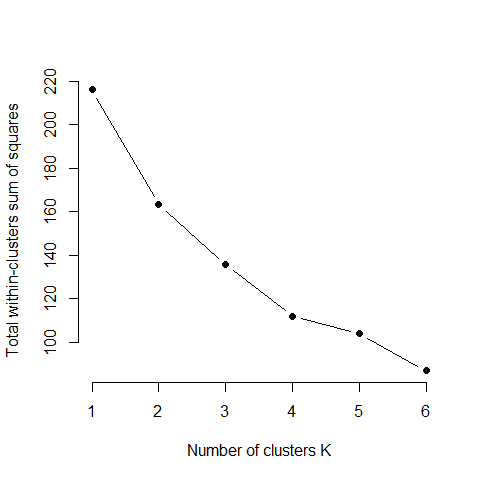

\newcommand\expect[1]{\mathbb{E}\left[{#1}\right]}
\newcommand\var[1]{\mathrm{Var}\left[{#1}\right]}


# Multivariate analysis

- Nature, and thus the ecological data, are multidimensional.

- A method to summarize redundancy, i.e., reduce the dimension, of ecological data.

- A method to detect and quantify an underlying trends shared by multiple variables

# Types of linear models

## Single dependent variable ($Y$) + single or multiple independent variable ($X$)
- linear regression
- ANOVA
- Contingency table, e.g. $\chi^2$ test

## multiple dependent variable ($Y$)
- Ordination, e.g., principle component analysis (PCA), canonical analysis (CA), non-metric multidimensional scaling (NMDS)
- cluster analysis, e.g., K-means, K-medoids

## multiple dependent variable ($Y$) + single independent variable ($X$)
- Multivariate ANOVA (MANOVA)
- Discriminant analysis

## multiple dependent variable ($Y$) + multiple independent variable ($X$)
- Redundancy analysis (RDA)
- Canonical correspondence analysis (CCA)

# Examples
Data is from my field work.


- Environmental data for each lake

```r
Field.raw <- read.table(file = "https://raw.githubusercontent.com/OscarFHC/OmniBEF_FieldNLA_public/master/FieldDat_raw.csv", 
                        sep = ",", header = TRUE)
head(Field.raw[, c(4:6, 8:10)])
```

```
##     pH  Cond Temp       PAR  TN_mean  TP_mean
## 1 8.33 408.8 21.9 0.5600000 20.68208 23.75631
## 2 8.61 257.7 20.8 0.6416667 63.02927 24.27327
## 3 8.19 358.7 20.6 0.4730539 40.83156 15.87882
## 4 8.23 314.8 24.5 0.3636364 28.14599 15.26339
## 5 8.30 256.3 26.4 0.3529412 37.36898 16.66657
## 6 8.58  93.9 27.6 0.6393443 52.13870 15.53418
```

- Zooplankton species composition: site by species in density (ind./ml) table

```r
zp.raw <- read.table(file = "https://raw.githubusercontent.com/OscarFHC/Multidimension/main/Data/Field_zpComm.csv", 
                        sep = ",", header = TRUE)
zp <- zp.raw[,2:52]
head(zp[,1:10])
```

```
##     X83936   X125923     X59270    X59074   X58633   X125904   X83971    X88634
## 1 12.92776  12.92776   12.92776  25.85552 12.92776  12.92776 12.92776  77.56657
## 2 20.52576 143.68032  759.45310 431.04095  0.00000   0.00000  0.00000 184.73183
## 3  0.00000  33.89607  101.68822   0.00000  0.00000   0.00000  0.00000 271.16858
## 4  0.00000 173.96746  154.63775  19.32972  0.00000   0.00000  0.00000 135.30803
## 5  0.00000   0.00000 1442.30769   0.00000  0.00000 346.15385  0.00000 403.84615
## 6  0.00000   0.00000  234.91797   0.00000  0.00000   0.00000  0.00000 249.60034
##     X88599     aaaaa
## 1 25.85552  38.78329
## 2  0.00000 513.14398
## 3  0.00000  33.89607
## 4 19.32972 212.62690
## 5  0.00000 692.30769
## 6 14.68237 499.20069
```

## multiple dependent variable ($Y$)
- Ordination, e.g., principle component analysis (PCA), canonical analysis (CA), non-metric multidimensional scaling (NMDS)
- cluster analysis, e.g., K-means, K-medoids

### PCA
#### PCA by environmental variables 

```r
envi <- as.data.frame(scale(Field.raw[, c(4:6, 8:10)], center = TRUE, scale = TRUE))
enviPCA <- prcomp(envi)
autoplot(enviPCA, loadings = TRUE, loadings.colour = 'blue',
         loadings.label = TRUE, loadings.label.size = 3)
```

<!-- -->

#### PCA by zooplankton spcies

```r
zp <- as.data.frame(scale(zp, center = TRUE, scale = TRUE))
spPCA <- prcomp(zp)
autoplot(spPCA, loadings = TRUE, loadings.colour = 'blue',
         loadings.label = TRUE, loadings.label.size = 3)
```

<!-- -->

#### NMDS by environmental variables
There is no "variation explained" in NMDS. 

```r
enviNMDS <- metaMDS(Field.raw[, c(4:6, 8:10)], k=2, trymax=100)
```

```
## Square root transformation
## Wisconsin double standardization
## Run 0 stress 0.1056573 
## Run 1 stress 0.1056573 
## ... Procrustes: rmse 1.341388e-05  max resid 4.971588e-05 
## ... Similar to previous best
## Run 2 stress 0.1056573 
## ... Procrustes: rmse 6.376243e-06  max resid 2.889569e-05 
## ... Similar to previous best
## Run 3 stress 0.1056574 
## ... Procrustes: rmse 0.0001558608  max resid 0.0007523763 
## ... Similar to previous best
## Run 4 stress 0.1056573 
## ... New best solution
## ... Procrustes: rmse 4.224001e-06  max resid 1.615253e-05 
## ... Similar to previous best
## Run 5 stress 0.1177956 
## Run 6 stress 0.1058689 
## ... Procrustes: rmse 0.01289228  max resid 0.06814914 
## Run 7 stress 0.1058689 
## ... Procrustes: rmse 0.01290599  max resid 0.06820472 
## Run 8 stress 0.1056573 
## ... New best solution
## ... Procrustes: rmse 4.473154e-06  max resid 1.646961e-05 
## ... Similar to previous best
## Run 9 stress 0.1058689 
## ... Procrustes: rmse 0.01288492  max resid 0.06811991 
## Run 10 stress 0.1056573 
## ... Procrustes: rmse 1.180951e-05  max resid 4.042318e-05 
## ... Similar to previous best
## Run 11 stress 0.1058689 
## ... Procrustes: rmse 0.01289089  max resid 0.06814509 
## Run 12 stress 0.1178729 
## Run 13 stress 0.3970367 
## Run 14 stress 0.1056573 
## ... Procrustes: rmse 5.040008e-05  max resid 0.0002339205 
## ... Similar to previous best
## Run 15 stress 0.1058689 
## ... Procrustes: rmse 0.01289519  max resid 0.06816143 
## Run 16 stress 0.1058689 
## ... Procrustes: rmse 0.01291264  max resid 0.06823333 
## Run 17 stress 0.3900224 
## Run 18 stress 0.1056573 
## ... Procrustes: rmse 1.323155e-05  max resid 6.240596e-05 
## ... Similar to previous best
## Run 19 stress 0.1056573 
## ... Procrustes: rmse 1.000161e-05  max resid 3.161194e-05 
## ... Similar to previous best
## Run 20 stress 0.1058689 
## ... Procrustes: rmse 0.01288298  max resid 0.06811209 
## *** Solution reached
```

```r
plot(enviNMDS)
```

<!-- -->

### K-means


```r
set.seed(1032)
autoplot(kmeans(envi, 2), data = envi)
```

```
## Warning: `select_()` is deprecated as of dplyr 0.7.0.
## Please use `select()` instead.
## This warning is displayed once every 8 hours.
## Call `lifecycle::last_warnings()` to see where this warning was generated.
```

<!-- -->

```r
autoplot(kmeans(envi, 3), data = envi)
```

<!-- -->

```r
autoplot(kmeans(envi, 4), data = envi)
```

<!-- -->

**Within group variation** (total within sum of square) to determine the number of cluster

```r
set.seed(1032)
envik2 <- kmeans(envi, 2)
envik2
```

```
## K-means clustering with 2 clusters of sizes 30, 7
## 
## Cluster means:
##           pH        Cond        Temp        PAR    TN_mean    TP_mean
## 1 -0.3600142  0.04709678 -0.09000433  0.0656248 -0.2638636 -0.3453918
## 2  1.5429182 -0.20184332  0.38573282 -0.2812492  1.1308438  1.4802506
## 
## Clustering vector:
##  [1] 1 1 1 1 1 1 1 2 1 1 1 1 1 1 1 1 2 2 2 2 1 2 1 2 1 1 1 1 1 1 1 1 1 1 1 1 1
## 
## Within cluster sum of squares by cluster:
## [1] 113.05359  50.11751
##  (between_SS / total_SS =  24.5 %)
## 
## Available components:
## 
## [1] "cluster"      "centers"      "totss"        "withinss"     "tot.withinss"
## [6] "betweenss"    "size"         "iter"         "ifault"
```


```r
set.seed(1032)
wss <- function(k) {
  kmeans(df, k, nstart = 10 )$tot.withinss
}

wss <- c()
for (i in 1:ncol(envi)){
  kn <- kmeans(envi, i)
  wss <- c(wss, kn$tot.withinss)
}

plot(wss ~ c(1:ncol(envi)),
     type="b", pch = 19, frame = FALSE, 
     xlab="Number of clusters K",
     ylab="Total within-clusters sum of squares")
```

<!-- -->


```r
set.seed(1032)
autoplot(kmeans(envi, 2), data = envi, frame = TRUE)
```

```
## Warning: `group_by_()` is deprecated as of dplyr 0.7.0.
## Please use `group_by()` instead.
## See vignette('programming') for more help
## This warning is displayed once every 8 hours.
## Call `lifecycle::last_warnings()` to see where this warning was generated.
```

<!-- -->

### K-medoids
minimizes a sum of dissimilarities instead of a sum of squared 

```r
set.seed(1032)

width <- c()
for (i in 1:ncol(envi)){
  width <- c(width, pam(envi, i)$silinfo$avg.width)
}

plot(width ~ c(2:ncol(envi)),
     type="b", pch = 19, frame = FALSE, 
     xlab="Number of clusters K",
     ylab="Total within-clusters similarity (silhouette)")
```

<!-- -->


```r
set.seed(1032)
autoplot(pam(envi, 3), frame = TRUE)
```

<!-- -->
## multiple dependent variable ($Y$) + single independent variable ($X$)
- Multivariate ANOVA (MANOVA)
- Discriminant analysis

### Multivariate ANOVA (MANOVA)

Add `group` to indicate the grouping number

```r
set.seed(1032)
envi_K3 <- pam(envi, 3)

envi <- envi %>% mutate(group = envi_K3$clustering)

head(envi)
```

```
##            pH        Cond         Temp        PAR     TN_mean     TP_mean group
## 1 -0.68021921 -0.01345254 -1.307179826  0.8414573 -0.68395332  0.26019313     1
## 2 -0.08250326 -1.09404327 -1.859528444  1.2574495 -0.04676913  0.28624607     1
## 3 -0.97907719 -0.37174239 -1.959955466  0.3985727 -0.38077078 -0.13680408     1
## 4 -0.89368919 -0.68569297 -0.001628546 -0.1587763 -0.57164636 -0.16781949     2
## 5 -0.74426021 -1.10405536  0.952428158 -0.2132553 -0.43287098 -0.09710436     2
## 6 -0.14654426 -2.26545798  1.554990287  1.2456197 -0.21063593 -0.15417271     2
```

Perform MANOVA to test grouping significance

```r
envi_MAN <- manova(cbind(pH, Cond, Temp, PAR, TN_mean, TP_mean) ~ group, data = envi)
summary(envi_MAN)
```

```
##           Df  Pillai approx F num Df den Df    Pr(>F)    
## group      1 0.75855   15.709      6     30 4.499e-08 ***
## Residuals 35                                             
## ---
## Signif. codes:  0 '***' 0.001 '**' 0.01 '*' 0.05 '.' 0.1 ' ' 1
```

Look for the variable(s) that is different among group


```r
summary.aov(envi_MAN)
```

```
##  Response pH :
##             Df Sum Sq Mean Sq F value Pr(>F)
## group        1  0.203 0.20269  0.1982 0.6589
## Residuals   35 35.797 1.02278               
## 
##  Response Cond :
##             Df Sum Sq Mean Sq F value Pr(>F)
## group        1  0.822 0.82202  0.8179  0.372
## Residuals   35 35.178 1.00509               
## 
##  Response Temp :
##             Df Sum Sq Mean Sq F value Pr(>F)
## group        1  1.668 1.66799  1.7004 0.2007
## Residuals   35 34.332 0.98091               
## 
##  Response PAR :
##             Df Sum Sq Mean Sq F value    Pr(>F)    
## group        1 19.579 19.5789  41.731 1.923e-07 ***
## Residuals   35 16.421  0.4692                      
## ---
## Signif. codes:  0 '***' 0.001 '**' 0.01 '*' 0.05 '.' 0.1 ' ' 1
## 
##  Response TN_mean :
##             Df Sum Sq Mean Sq F value Pr(>F)
## group        1  0.202 0.20186  0.1974 0.6596
## Residuals   35 35.798 1.02280               
## 
##  Response TP_mean :
##             Df Sum Sq Mean Sq F value Pr(>F)
## group        1    2.3 2.30045  2.3892 0.1312
## Residuals   35   33.7 0.96284
```

### Discriminant analysis
To find a linear combination of features that characterizes or separates two or more classes of objects or events

```r
envi_LDA <- lda(group ~ pH + Cond + Temp + PAR + TN_mean + TP_mean, data = envi)
envi_LDA
```

```
## Call:
## lda(group ~ pH + Cond + Temp + PAR + TN_mean + TP_mean, data = envi)
## 
## Prior probabilities of groups:
##         1         2         3 
## 0.2702703 0.4864865 0.2432432 
## 
## Group means:
##           pH       Cond       Temp         PAR    TN_mean    TP_mean
## 1 -0.4838268  0.5058889 -0.8753436  0.92621912 -0.3813532 -0.1448050
## 2  0.4286387 -0.3426994  0.6600739  0.04162149  0.3150043  0.5279240
## 3 -0.3196921  0.1232999 -0.3475438 -1.11237534 -0.2062828 -0.8949537
## 
## Coefficients of linear discriminants:
##                 LD1        LD2
## pH       0.57405055 -0.3758025
## Cond    -0.41165484  0.4236530
## Temp    -0.03548875 -1.2226172
## PAR     -1.77297270  0.2322527
## TN_mean -0.32741994 -0.0627681
## TP_mean -1.19627528 -0.5038526
## 
## Proportion of trace:
##   LD1   LD2 
## 0.606 0.394
```


```r
cbind(envi, predict(envi_LDA)$x) %>%
  ggplot(aes(LD1, LD2, color = as.factor(group))) +
  geom_point() +
  labs(color = "group")
```

<!-- -->

## multiple dependent variable ($Y$) + multiple independent variable ($X$)
- Redundancy analysis (RDA)
- Canonical correspondence analysis (CCA)

### Redundancy analysis (RDA)


```r
RDA <- capscale(zp ~ pH + Cond + Temp + PAR + TN_mean + TP_mean, data = envi)
plot(RDA)
```

<!-- -->

```r
plot(RDA, display = c("sites", "cn"))
```

<!-- -->

Can manually determine how to calculate the dissimilarity among sites

```r
zp.raw <- read.table(file = "https://raw.githubusercontent.com/OscarFHC/Multidimension/main/Data/Field_zpComm.csv", 
                        sep = ",", header = TRUE)
zp <- zp.raw[,2:52]
RDA_br <- capscale(zp ~ pH + Cond + Temp + PAR + TN_mean + TP_mean, data = envi, distance = "bray")
plot(RDA_br)
```

<!-- -->

```r
plot(RDA_br, display = c("sites", "cn"))
```

<!-- -->
